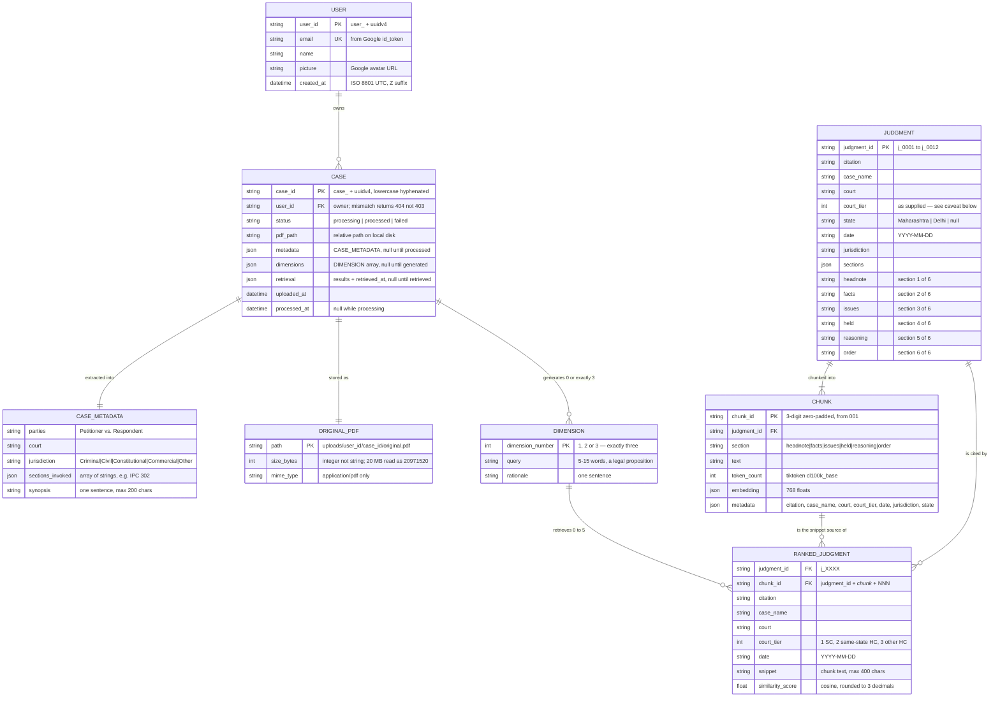

# Mini-JuriNex — Entity Relationship Diagram

Mermaid source. Renders natively on GitHub and in VS Code.

The interesting thing about this data model is that it spans **four physical stores**, only two of
which are a database. The specs never prescribe a schema — `01_architecture.md` §5 says metadata may
live in "an in-memory dict or Firestore — implementer's choice" — so what follows is the schema this
build defines, derived from the response contracts in `03_backend_spec.md` §6 and the chunk shape in
`04_ai_ml_spec.md` §3.3.

---

## 1. Where each entity physically lives

| Entity | Store | Mutability | Why |
|---|---|---|---|
| `USER` | SQLite `users` | created on first sign-in | Session identity |
| `CASE` | SQLite `cases` | created on upload, updated by pipeline | Owns metadata, dimensions, retrieval |
| `CASE_METADATA` | JSON column on `cases` | written once by Gemini | Returned nested, never queried by field |
| `DIMENSION` | JSON column on `cases` | overwritten on regeneration | Exactly 3, idempotent endpoint |
| `RANKED_JUDGMENT` | JSON column on `cases` | overwritten on re-retrieval | Derived; snapshot of a retrieval run |
| `ORIGINAL_PDF` | local disk | write-once | `data/uploads/{user_id}/{case_id}/original.pdf` |
| `JUDGMENT` | `data/judgments_corpus.json` | **read-only, provided** | 12 supplied judgments |
| `CHUNK` | `data/corpus_index.json` → FAISS | rebuilt only by indexing script | ~72 chunks × 768 floats (est., see §3) |

`DIMENSION` and `RANKED_JUDGMENT` are stored as JSON rather than as tables because the contract
returns them nested inside the case (`GET /cases/{case_id}` shows `dimensions` and `retrieval` as
`null` until generated) and nothing ever queries them by field. Normalising them would add joins that
buy nothing and risk drifting from the response shape — which is worth 20 of the 100 rubric points.

---

## 2. Diagram



---

## 3. Cardinality notes

- **`USER` → `CASE`** is one-to-many. A user sees only their own cases; another user's case returns
  **404, not 403**, to avoid leaking existence (`01_architecture.md` §11).
- **`CASE` → `DIMENSION`** is zero-or-exactly-three. Never 1, 2, 4 or 5. If Gemini returns another
  count the build re-prompts once and then errors rather than degrading.
- **`DIMENSION` → `RANKED_JUDGMENT`** is zero-to-five. **Zero is legitimate** — when nothing clears
  the 0.65 threshold, the dimension returns `judgments: []` and the UI renders
  `No precedents found for this dimension.` This is why the empty state exists and why "lower the
  threshold until 5 come back" is the wrong reading of the spec.
- **`JUDGMENT` → `CHUNK`** is expected to be one-to-exactly-six, because on a chars÷4 estimate no
  section in this corpus reaches the 400-token target, so every section emits a single chunk.
  **This is an estimate pending real `tiktoken` counts on Day 2** — see the note in
  `FLOWCHART.md` §5. Written as `||--|{` (one-to-many) regardless, because the chunker genuinely
  splits longer sections and that path is exercised by unit tests on synthetic input.
- **`CHUNK` → `RANKED_JUDGMENT`** exists because step 4 of `04_ai_ml_spec.md` §5.2 collapses chunks
  to judgments, keeping only the highest-similarity chunk per judgment. So a ranked result carries
  exactly one `chunk_id`, and `snippet` is that chunk's text.

---

## 4. Three schema choices the spec does not make

The spec defines no schema, so these are decisions, not transcriptions. Each goes in `QUESTIONS.md`
or `DEVIATIONS.md` rather than being buried in the DDL.

1. **`status` includes `failed`, which the spec never mentions.** `03_backend_spec.md` only ever
   shows `"processing"` (§5.2) and `"processed"` (§5.3). The open question is what happens when OCR
   fails: the endpoint returns 422, but a `case_id` was already minted and the PDF already written
   to disk. Either no row is persisted (so the 422 leaves an orphaned file), or a row persists with
   `status = 'failed'` — in which case `GET /api/v1/cases` would list a case whose `parties` is
   null, and §5.3's list contract has no null-safe shape for that. This build persists `failed` and
   filters it out of the list response. Flagged, not assumed.

2. **"Max 20 MB" is read as 20,971,520 bytes** (20 × 1024²), not 20,000,000. The spec says only
   "20 MB". A 20.5 MB file is accepted under one reading and 413s under the other.

3. **`sections_invoked` and `sections` are stored as JSON arrays, not join tables.** Nothing queries
   by section, and the contract returns them as arrays of strings.

## 5. Two caveats worth knowing

**`JUDGMENT.court_tier` is not trustworthy as supplied.** `04_ai_ml_spec.md` §5.3 defines tier 2 as
"High Court of the same state as the uploaded case" and tier 3 as any other High Court — so tier is
*relative to the case being searched*, not a fixed property of a judgment. The corpus hardcodes it
as though every case originated in Maharashtra: `j_0002` and `j_0004` and `j_0012` (Bombay HC) are
tier 2, while `j_0008` (Delhi HC) is tier 3. Upload a Delhi-origin case and those are inverted.

The ranker therefore **recomputes** tier from `JUDGMENT.state` against the case's state rather than
reading the stored field. Both supplied sample PDFs happen to be Maharashtra matters, so the baked
values are coincidentally correct for them — which is exactly why this is easy to miss. Logged in
`QUESTIONS.md`.

**Tier 4 is unrepresented.** `court_tier` values in the corpus are only `{1, 2, 3}` — there are no
District Court judgments — so the "exclude tier 4 entirely" rule can never fire on real data. Its
unit test uses synthetic rows.

---

## 6. SQLite DDL

```sql
CREATE TABLE users (
    user_id     TEXT PRIMARY KEY,          -- 'user_' || uuid4
    email       TEXT NOT NULL UNIQUE,
    name        TEXT,
    picture     TEXT,
    created_at  TEXT NOT NULL              -- '%Y-%m-%dT%H:%M:%SZ'
);

CREATE TABLE cases (
    case_id      TEXT PRIMARY KEY,         -- 'case_' || uuid4
    user_id      TEXT NOT NULL REFERENCES users(user_id),
    status       TEXT NOT NULL CHECK (status IN ('processing','processed','failed')),
    pdf_path     TEXT NOT NULL,
    metadata     TEXT,                     -- JSON, null until processed
    dimensions   TEXT,                     -- JSON array, null until generated
    retrieval    TEXT,                     -- JSON object, null until retrieved
    uploaded_at  TEXT NOT NULL,
    processed_at TEXT
);

CREATE INDEX idx_cases_user_uploaded ON cases(user_id, uploaded_at DESC);
```

The index serves `GET /api/v1/cases`, which returns a user's cases ordered by `uploaded_at`
descending (`03_backend_spec.md` §5.3).

Timestamps are stored as text in the exact wire format — `%Y-%m-%dT%H:%M:%SZ`, no `+00:00`, no
milliseconds — so no reformatting happens on read and the format cannot drift between storage and
response.

> **Free-tier caveat:** Render's free tier has **ephemeral disk**. The SQLite file and uploaded PDFs
> are lost on every restart and cold start, so the case-history list starts empty after an idle
> period. This is deviation **D-001 / D-004**, documented with its tradeoff in `DEVIATIONS.md`. It
> does not affect a grading session, which uploads and reviews in one sitting, and it does not
> affect `eval.py` at all — the FAISS index is rebuilt from the committed `corpus_index.json`, which
> *is* in git.
