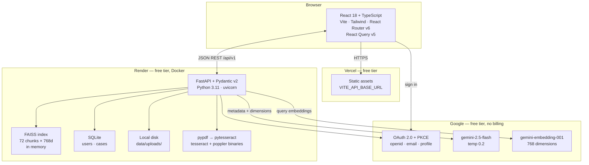
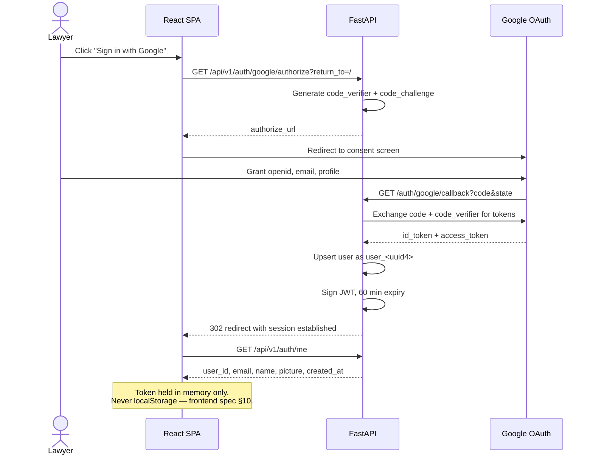
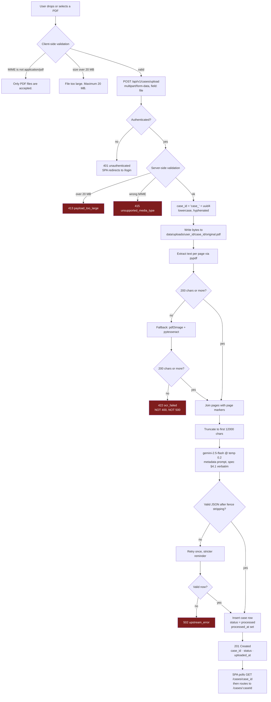
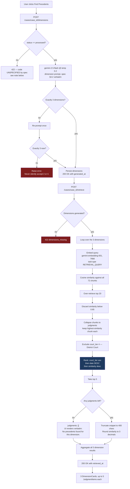
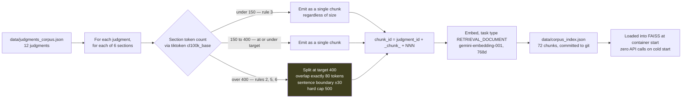
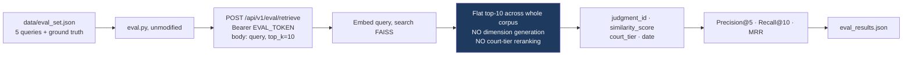
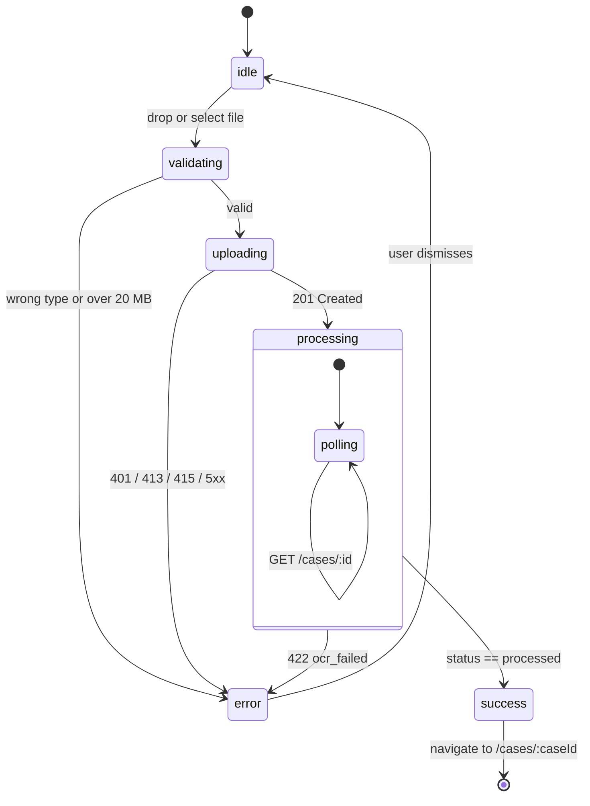

# Mini-JuriNex — Flow Charts

Mermaid source. Renders natively on GitHub and in VS Code (Markdown Preview Mermaid Support).

Reflects the **free-tier build** as agreed: SQLite + local disk, FAISS in-memory, Render + Vercel,
`gemini-embedding-001` @ 768d in place of the retired `text-embedding-004`. Spec section references
point into `auxillary/Lawapp_Project/specs/`.

---

## 1. System architecture

**Deviations visible here:** Render replaces Cloud Run (D-002); local disk replaces GCS with signed
URLs (D-001, D-004); `gemini-embedding-001` replaces `text-embedding-004` (D-003). FAISS and SQLite
are both explicitly permitted by `01_architecture.md` §4.5 and §5.

---

## 2. Authentication — OAuth 2.0 Authorization Code + PKCE

Any `401 unauthenticated` from a protected route sends the SPA to `/login` (F-12).

---

## 3. Upload pipeline

`01_architecture.md` §5 · `03_backend_spec.md` §5.2, §7 · `04_ai_ml_spec.md` §4.1

Processing is **synchronous** inside the one request — `03_backend_spec.md` §8. No Celery, no
Pub/Sub. Render's request timeout must exceed the Gemini round trip; the spec says a run over 60
seconds returns 504, "but this should not happen for the sample PDFs provided."

**Contradiction found while drawing this — for `QUESTIONS.md`.** §5.2 specifies the 201 body as
`"status": "processing"`, yet the same section says "the endpoint blocks until processing completes
or fails." The status is therefore **stale the moment it is emitted** — the work is already done —
and the frontend (`02_frontend_spec.md` §5.2) then polls `GET /cases/:id` "until status =
`processed`" for a transition that has already happened. Both sample files show `"processed"`.

Resolution: return `"processing"` literally as §5.2 shows, since sample I/O is diffed and worth 20
points, and keep the frontend poll so the documented state machine still holds. The poll will
simply succeed on its first call. Logged rather than silently "fixed".

---

## 4. Query pipeline — dimensions then retrieval

`01_architecture.md` §7 · `04_ai_ml_spec.md` §4.2, §5

The tie-breaker chain in the blue node is graded: **`court_tier` ascending → `date` descending →
`similarity_score` descending**. Date descending is the easy one to miss.

**Two error-code gaps found while drawing this — both for `QUESTIONS.md`:**

- `03_backend_spec.md` §5.4 says "422 if case is not yet `processed`" but **names no `code`**. The
  §4 table offers only `ocr_failed` (wrong — the PDF read fine) and `validation_error` (wrong — it
  is documented as "Pydantic validation failed on request body", and the body here is empty). So no
  listed code fits. Resolution: emit `case_not_processed` and log the invention, rather than
  misuse `validation_error`.
- `dimensions_missing` (§5.5) is **absent from the §4 error table**, so that table is not
  exhaustive. Harmless, but it means the table cannot be used as the single source of truth when
  building the error enum.

---

## 5. Corpus indexing — one-time, offline

`01_architecture.md` §8 · `04_ai_ml_spec.md` §3

> **Finding (approximate — verify on Day 2).** On a chars÷4 estimate the longest section is ~227
> tokens and 60 of 72 fall under 150, which would mean the yellow node **never executes on real
> data**: every section emits one chunk, giving 72 chunks with indices `001`–`006` per judgment.
>
> These are estimates, not measurements — `tiktoken` is not installed locally yet. Legal text
> tokenizes denser than plain prose (`Section 65B(4)` costs several tokens for few characters), so
> real counts will run **higher** than the estimate. The margin on the load-bearing claim is
> comfortable (227 → 400 needs a 76% underestimate), but "60 of 72 under 150" is fragile and some
> sections will likely cross the minimum. **Re-measure with real `tiktoken` counts on Day 2 before
> relying on the 72-chunk figure**, and fix the exact number in `CLAUDE.md` and
> `plan_to_do/BUILD_PLAN.md`, which currently repeat the estimate.
>
> Either way the overlap, sentence-boundary and 500-cap logic must be implemented correctly and is
> proven by unit tests on synthetic input (`SPEC_COMPLIANCE.md` M-04/05/06, B-20).

---

## 6. Evaluation path — bypasses everything above

`starter_repo/README.md` · `eval/eval.py` is **locked**

Two things about this endpoint:

- It is documented **only** in `starter_repo/README.md`, nowhere in the four specs. Miss it and the
  locked script errors out and scores 0.0 on all three metrics.
- Whether the 0.65 threshold applies here is genuinely ambiguous. The build argues **no** — the
  starter README calls it "the raw retriever… in isolation from the ranking logic", and the
  threshold belongs to `04_ai_ml_spec.md` §5.2's filter stage. Logged in `QUESTIONS.md`.

`data/eval_set.json` is ground truth and **must never appear inside a prompt** — that is an explicit
disqualifier.

---

## 7. Frontend states

Frontend spec §9 — every data-fetching component handles all four explicitly. No silent
"nothing happens".

Per-`DimensionCard`: `loading` → `success` \| `empty` \| `error`, where `empty` renders the byte-exact
string `No precedents found for this dimension.` and `error` offers a Retry.
